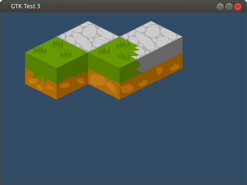

# Эксперименты с GTK+ 3 на Си и Обероне

*See English below*

## Установка (Дебиан)
```
sudo apt-get install libgtk-3-dev gcc make
```

## Компиляция и запуск
```
cd gtk1
make run
```

-----------

# GTK+ 3 experiments in C and Oberon

## Setup (Debian)
```
sudo apt-get install libgtk-3-dev gcc make
```

## Compile & Run
```
cd gtk1
make run
```
